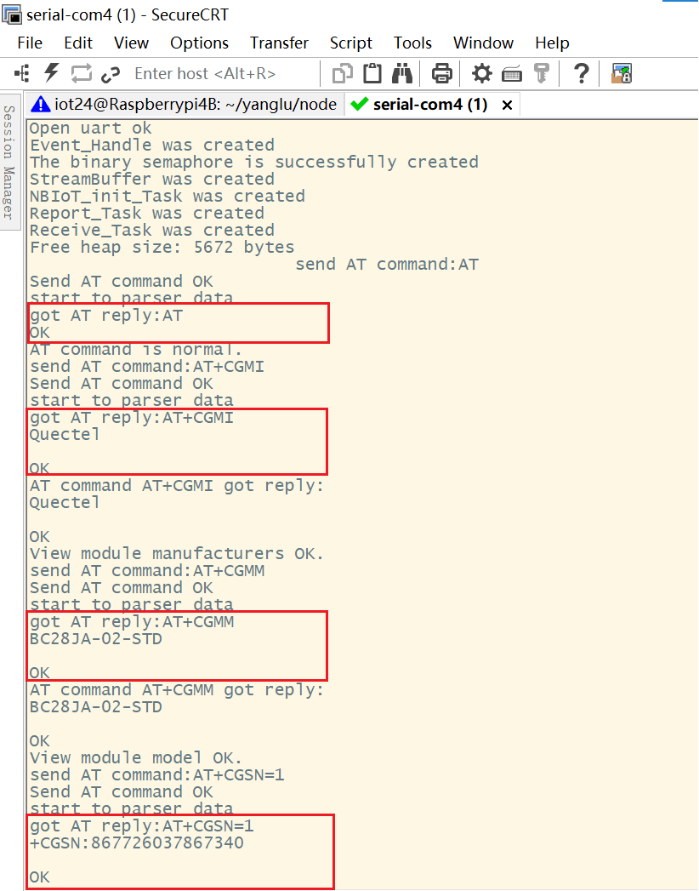
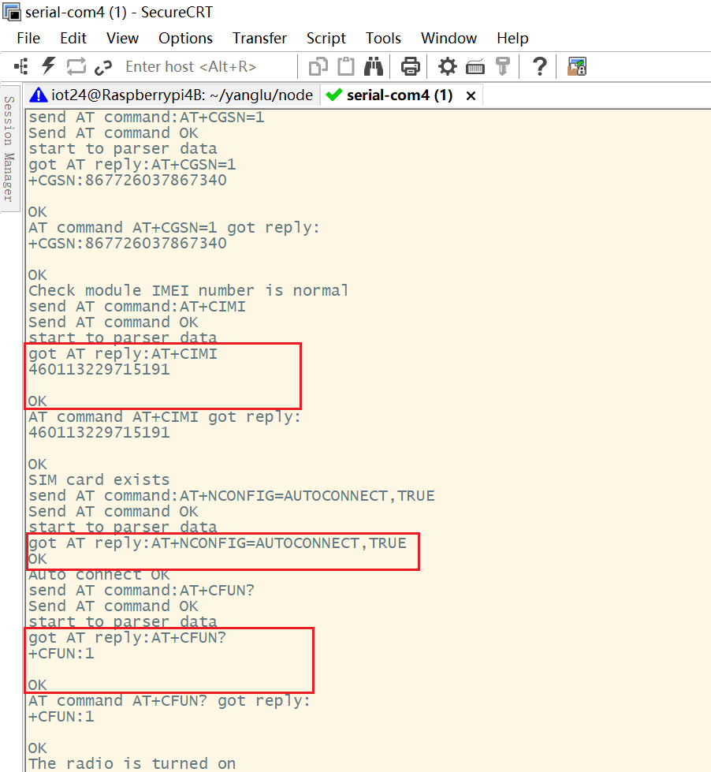
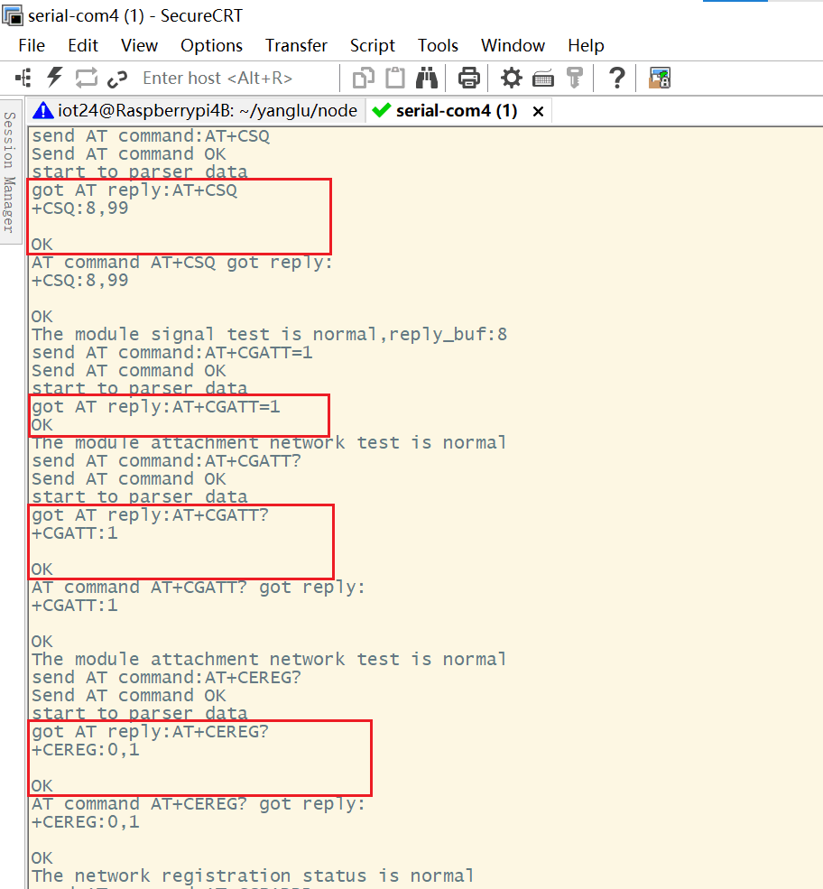
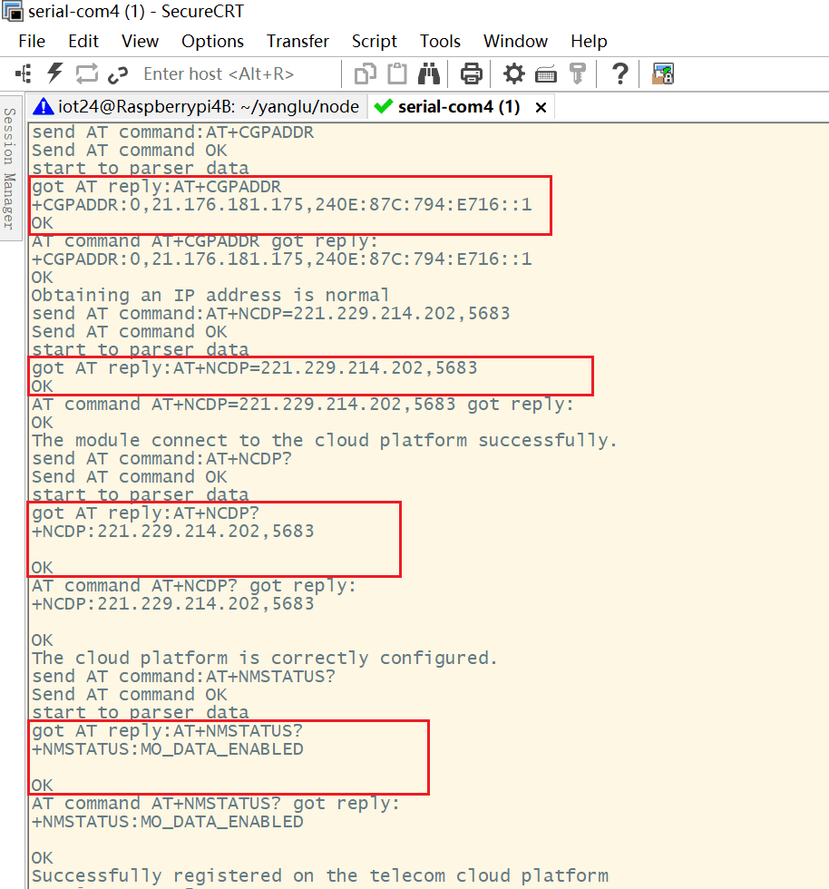
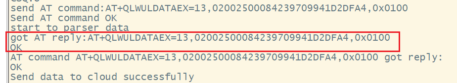
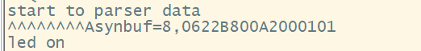
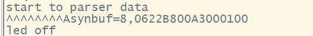
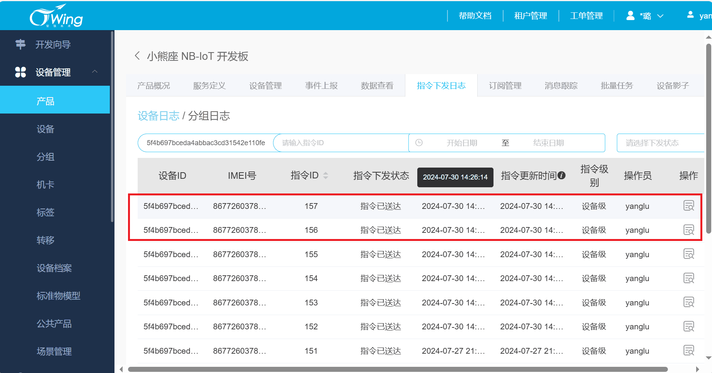
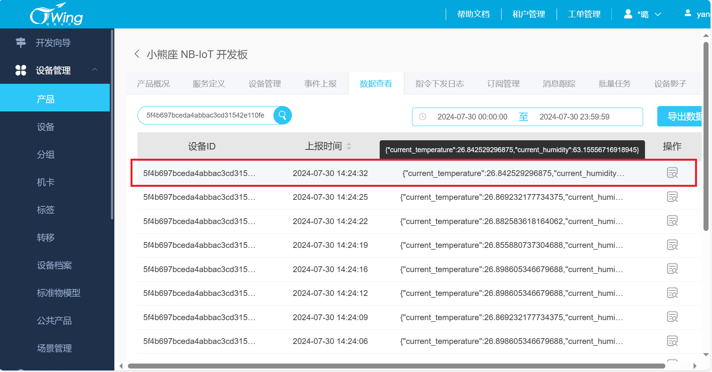

# 本Git介绍

# 项目介绍

## 单片机侧

通过部署sht30传感器以及bc28模块，通过MCU编写代码实现bc28模块的AT通信。将传感器采集的温湿度通过bc28模块上传至天翼物联网云平台，并且及时对下发指令进行解析，完成相应的智能控制。

# **目录结构**

```
.
+--- .gitignore
+--- Inc
|   +--- at-bc28.h
|   +--- at_cmd.h
|   +--- FreeRTOSConfig.h
|   +--- gpio_led.h
|   +--- gpio_i2c.h
|   +--- main.h
|   +--- sht30.h
|   +--- tim.h
|   +--- usart.h
+--- README.md
+--- Src 
|   +--- at-bc28.c
|   +--- at_cmd.c
|   +--- freertos.c
|   +--- gpio_led.c
|   +--- gpio_i2c.c
|   +--- main.c
|   +--- sht30.c
|   +--- tim.c
|   +--- usart.c
```

- **README.md**

对整个项目的介绍以及各个功能的实现。

- **Src**

该文件夹下保存了开发sht30温湿度采集、AT命令解析、AT命令发送及整体项目实现的源文件。

1. sht30.c：通过sht30传感器获取当前温湿度。
2. gpio_i2c.c:利用gpio模拟i2c。
3. at-bc28.c:bc28模块实现联网的AT命令层。
4. at-cmd.c：实现AT命令的解析。
5. gpio_led.c：初始化绿灯引脚，实现灯的开关。
6. usart.c:初始化串口，实现串口收发数据。
7. main.c：通过FreeRTOS系统管理任务的调度，实现整个数据上报和接收下发指令的功能。

- **Inc**

该文件夹下保存了Src中相应的头文件，对代码的声明。

- **.gitignore**

该文件用于git上传文件时忽略掉不想上传的文件，这里我忽略掉stm32L433相关的库文件。

# 项目功能

- MCU编程实现通过AT命令控制bc28模块注册上网与电信云连接
- sht30传感器检测空气中的温湿度，并利用AT命令通过bc28模块发送给电信云平台
- MCU将收到的AT命令的回复以及下发的指令进行解析
- 电信云平台下发指令控制灯的亮灭

# 功能截图

## bc28模块实物图：

红框里的为bc28模块。


## 模块收发解析数据：

##### 配置bc28模块，模块成功注册连接云平台。











##### 模块成功给云平台发送数据。



**平台下发指令后解析控制相应设备。**

开灯：




关灯：




## 天翼物联网云平台：

##### 平台下发指令。



##### 平台接收到数据。

