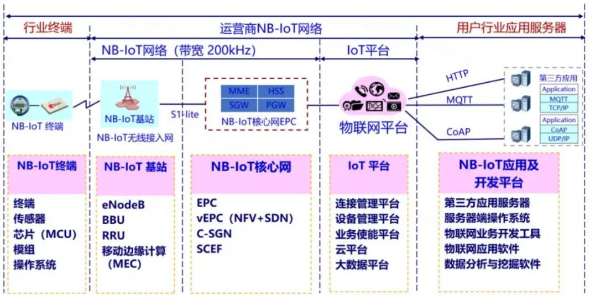

# 基于NB-IoT网络架构的温室大棚环境监测系统

# NB-IoT的网络架构

NB-IoT 网络组成包括 NB-IoT 终端、NB-IoT 基站、NB-IoT 分组核心网、IoT 连接管理平台和行业应用服务器。

# 项目背景

窄带物联网（NB-IoT）作为一种新兴的物联网技术，以其低功耗、广覆盖和大连接的特点，成为智慧农业中关键的通信技术。在智慧农业中，NB-IoT的应用场景广泛，涵盖环境监测、远程控制等多个方面。通过布置在温室大棚、农田和果园中的各种传感器（如温湿度传感器、土壤湿度传感器、光照传感器等），实时监测环境参数。NB-IoT模块将这些数据传输至云平台，农民和管理者可以通过移动应用或计算机实时查看和分析环境数据，及时调整生产措施。NB-IoT技术在智慧农业中的应用，推动了农业生产方式的变革，提高了农业生产的智能化和精准化水平。随着NB-IoT技术的不断成熟和推广应用，智慧农业将迎来更加广阔的发展前景，为实现农业现代化和可持续发展提供有力支撑。

# 项目简介

本项目中，通过部署SHT30温湿度传感器和NB-IoT BC28模块，分别在单片机下结合FreeRTOS操作系统以及在ARM Linux架构下的IMX6ULL开发板上，成功实现了与云平台的数据交互和指令下发控制，实现了智能化管理。最后通过对两端代码的抽象处理，实现了代码的跨平台，确保了代码的兼容性。

# 仓库分支

该仓库有四个分支：

main分支存放项目介绍以及分支分布；NBIoT-BearKE1分支存放单片机侧代码；NBIoT-imx6ull分支存放Linux侧代码；Cross-platform-development分支存放跨平台代码。

**单片机侧代码：**

https://github.com/yllluuu/NB-IoT/tree/NBIoT-BearKE1

**Linux侧代码：**

https://github.com/yllluuu/NB-IoT/tree/NBIoT-imx6ull

**跨平台代码：**

https://github.com/yllluuu/NB-IoT/tree/Cross-platform-development