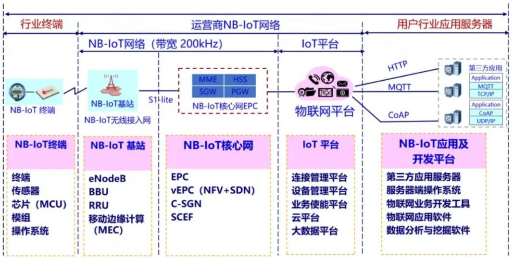
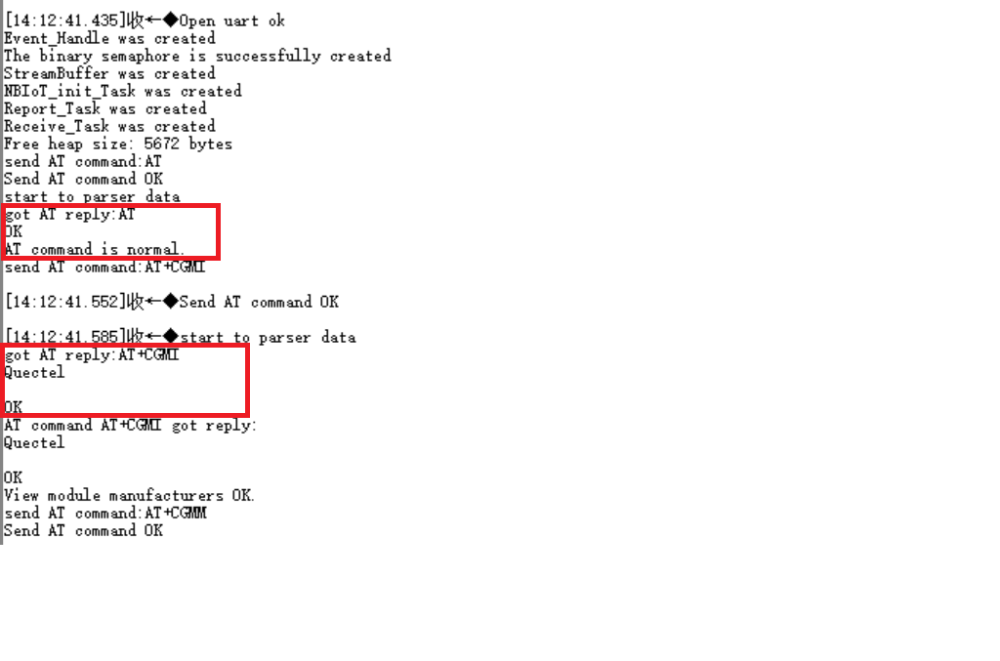
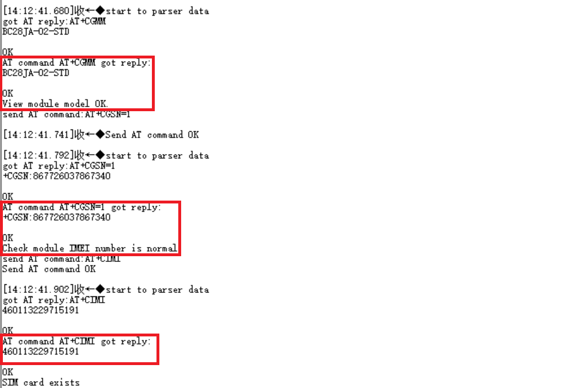
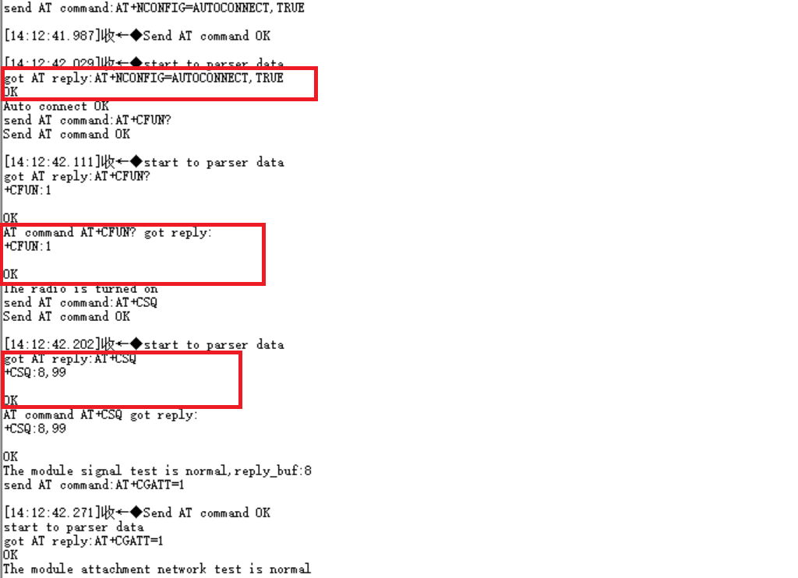
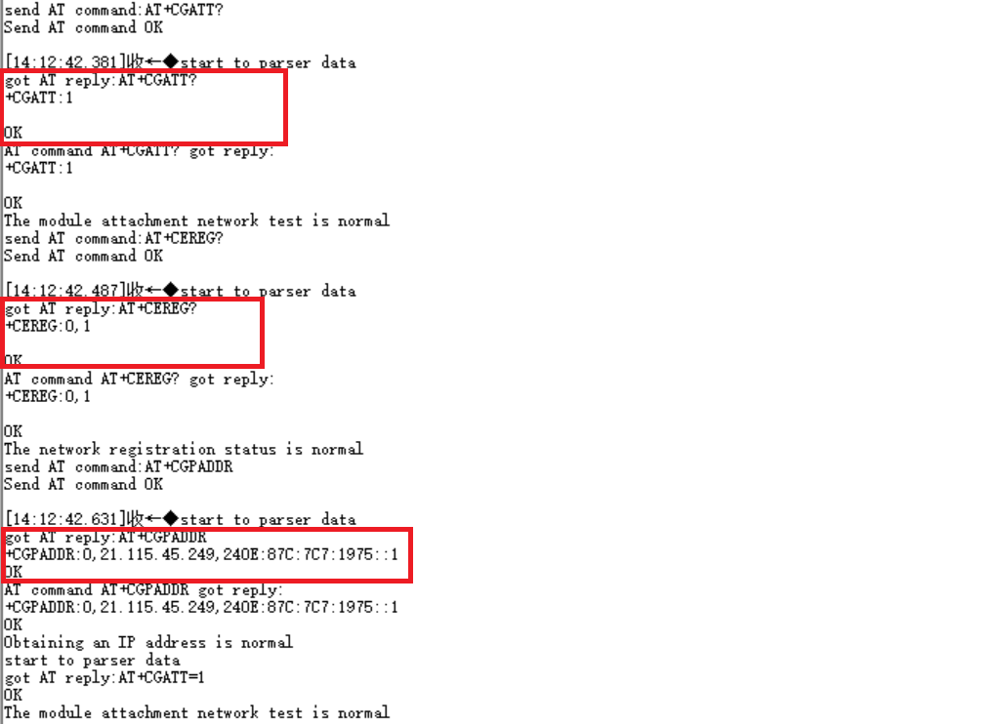
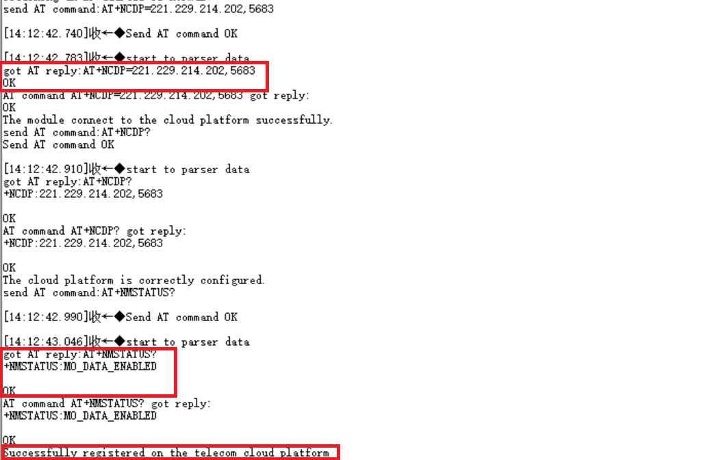
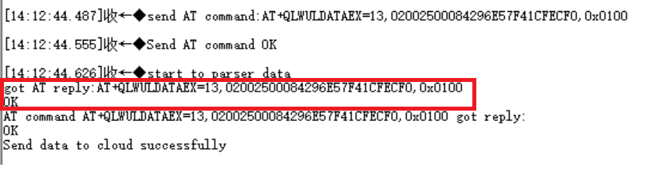
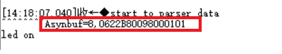
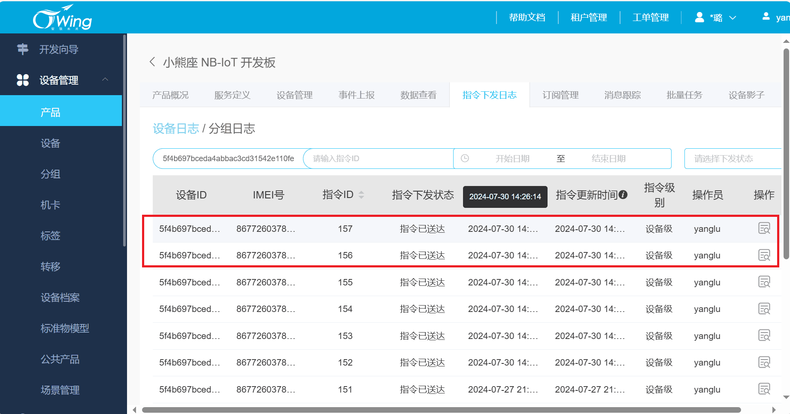
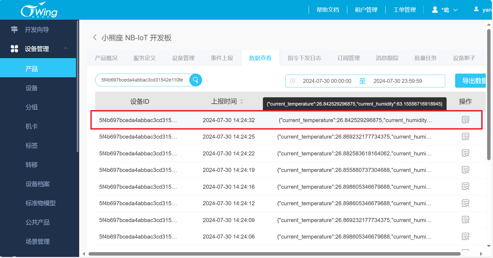

# 基于NB-IoT网络架构的温室大棚环境监测系统

# 项目背景

窄带物联网（NB-IoT）作为一种新兴的物联网技术，以其低功耗、广覆盖和大连接的特点，成为智慧农业中关键的通信技术。在智慧农业中，NB-IoT的应用场景广泛，涵盖环境监测、远程控制等多个方面。通过布置在温室大棚、农田和果园中的各种传感器（如温湿度传感器、土壤湿度传感器、光照传感器等），实时监测环境参数。NB-IoT模块将这些数据传输至云平台，农民和管理者可以通过移动应用或计算机实时查看和分析环境数据，及时调整生产措施。NB-IoT技术在智慧农业中的应用，推动了农业生产方式的变革，提高了农业生产的智能化和精准化水平。随着NB-IoT技术的不断成熟和推广应用，智慧农业将迎来更加广阔的发展前景，为实现农业现代化和可持续发展提供有力支撑。

# 项目简介

本项目中，我采用了NB-IoT BC28模块，并通过单片机（MCU）来实现其控制。该系统主要功能包括实时监测和上传温湿度数据，温湿度传感器（如SHT30）采集环境数据后，通过单片机发送给BC28模块，再由BC28模块通过NB-IoT网络将数据上传至天翼物联网平台。以及接收云平台下发的指令，进而对相应设备进行智能控制。

# NB-IoT的网络架构

NB-IoT 网络组成包括 NB-IoT 终端、NB-IoT 基站、NB-IoT 分组核心网、IoT 连接管理平台和行业应用服务器。



# 本Git介绍

**目录结构**

```
.
+--- .gitignore
+--- Inc
|   +--- at-bc28.h
|   +--- at_cmd.h
|   +--- FreeRTOSConfig.h
|   +--- gpio_led.h
|   +--- gpio_i2c.h
|   +--- main.h
|   +--- sht30.h
|   +--- tim.h
|   +--- usart.h
+--- README.md
+--- Src 
|   +--- at-bc28.c
|   +--- at_cmd.c
|   +--- freertos.c
|   +--- gpio_led.c
|   +--- gpio_i2c.c
|   +--- main.c
|   +--- sht30.c
|   +--- tim.c
|   +--- usart.c
```

- **README.md**

对整个项目的介绍以及各个功能的实现。

- **Src**

该文件夹下保存了开发sht30温湿度采集、AT命令解析、AT命令发送及整体项目实现的源文件。

1. sht30.c：通过sht30传感器获取当前温湿度。
2. gpio_i2c.c:利用gpio模拟i2c。
3. at-bc28.c:bc28模块实现联网的AT命令层。
4. at-cmd.c：实现AT命令的解析。
5. gpio_led.c：初始化绿灯引脚，实现灯的开关。
6. usart.c:初始化串口，实现串口收发数据。
7. main.c：通过FreeRTOS系统管理任务的调度，实现整个数据上报和接收下发指令的功能。

- **Inc**

该文件夹下保存了Src中相应的头文件，对代码的声明。

- **.gitignore**

该文件用于git上传文件时忽略掉不想上传的文件，这里我忽略掉stm32L433相关的库文件。

# 项目功能

- MCU编程实现通过AT命令控制bc28模块注册上网与电信云连接
- sht30传感器检测空气中的温湿度，并利用AT命令通过bc28模块发送给电信云平台
- MCU将收到的AT命令的回复以及下发的指令进行解析
- 电信云平台下发指令控制灯的亮灭

# 功能截图

## bc28模块实物图：

红框里的为bc28模块。


## 模块收发解析数据：

##### 配置bc28模块，模块成功注册连接云平台。












##### 模块成功给云平台发送数据。



**平台下发指令后解析控制相应设备。**




## 天翼物联网云平台：

##### 平台下发指令。



##### 平台接收到数据。

