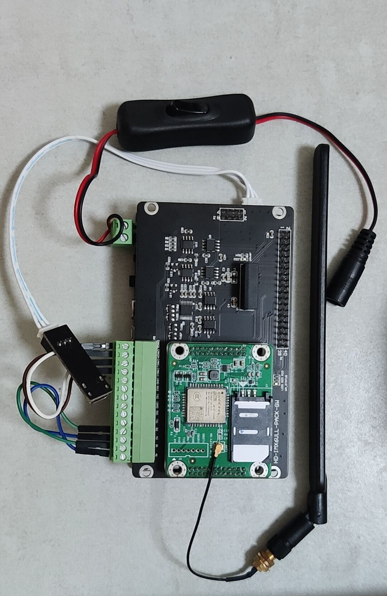

# 本Git介绍

# 项目介绍

## ARM-Linux平台

在Linux侧，我在树莓派上编写代码，并通过交叉编译将可执行文件部署到IMX6ULL开发板上。该板子通过I2C接口与SHT20温湿度传感器连接，以实时获取环境数据，并通过与BC28模块的串口通信，将数据通过NB-IoT网络传输到天翼物联网平台。同时，我编写了代码来接收和解析平台下发的指令，以控制相关设备进行响应。

在此基础上，我对STM32单片机和Linux系统的API进行了对比研究，并成功封装了串口通信层、AT指令收发层以及BC28模块的AT指令层，使得代码能够在这两个平台之间相互移植，达到跨平台使用的目的。

# Linux侧目录结构及使用

```
.
+--- lib
|   +--- gpiod
|      +--- build.sh     #gpiod库的构建脚本
|      +--- makefile   
+--- makefile             #进行编译连接生成可执行文件
+--- Inc
|   +--- at-bc28.h
|   +--- at_cmd.h
|   +--- nbiot.h
|   +--- leds.h
|   +--- sht20.h
|   +--- logger.h
|   +--- comport.h
+--- README.md
+--- Src 
|   +--- at-bc28.c
|   +--- at_cmd.c
|   +--- leds.c
|   +--- sht20.c
|   +--- logger.c
|   +--- nbiot.c
|   +--- comport.c
|   +--- makefile         #生成静态库
+--- main.c               #业务逻辑层代码      
```

- **README.md**

对整个项目的介绍以及各个功能的实现。

- **Src**

该文件夹下保存了开发sht20温湿度采集、AT命令解析、AT命令发送及整体项目实现的源文件。

1. sht20.c：通过sht20传感器获取当前温湿度。
2. at-bc28.c:bc28模块实现联网的AT命令层。
3. at-cmd.c：实现AT命令的解析。
4. leds.c：初始化绿灯引脚，实现灯的开关。
5. comport.c:初始化串口，实现串口收发数据。
6. main.c：通过命令行参数解析，使用多线程实现整个数据上报和接收下发指令的功能。
7. logger.c：日志系统，用来记录调试信息
8. makefile：生成代码所需的静态库

- **Inc**

该文件夹下保存了Src中相应的头文件，对代码的声明。

- **lib/gpiod**

1. build.sh:构建gpiod开源库
2. makefile：执行build.sh，生成gpiod库

- **makefile**

用于进入lib/gpiod执行生成gpiod开源库，进入src/生成代码静态库，并且生成可执行文件

# 代码使用

**1.** **执行makefile自动生成gpiod库和静态库，并生成可执行程序**

```sh
make
```

**2.执行nbiot，注意添加参数**

-h打印帮助信息，-n设备路径，-t采样温湿度间隔 

```
例如：
./nbiot -n "/dev/ttyUSB0" -t 10
```

# IMX6ULL开发板及bc28模块：



# 模块收发解析数据：

##### 模块成功给云平台发送数据。


##### 日志文件


##### 平台下发指令（天翼物联网平台）


##### 

