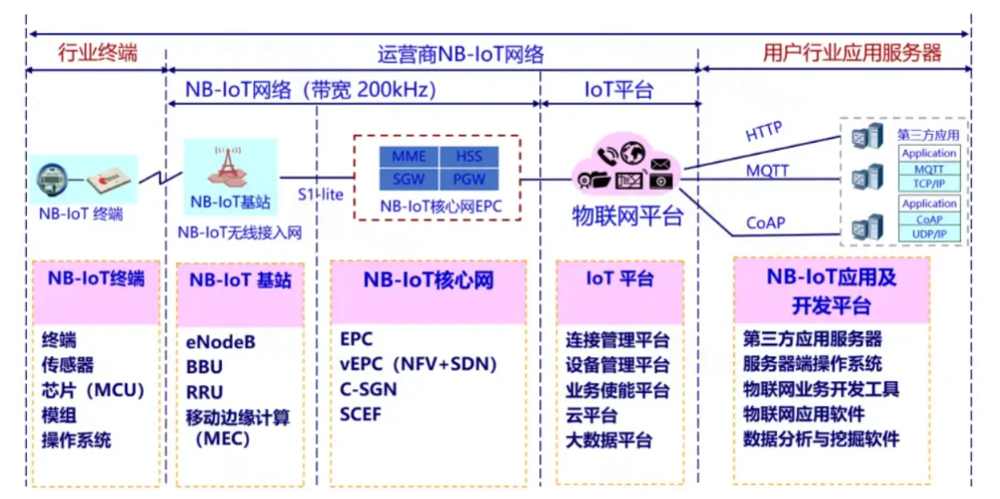
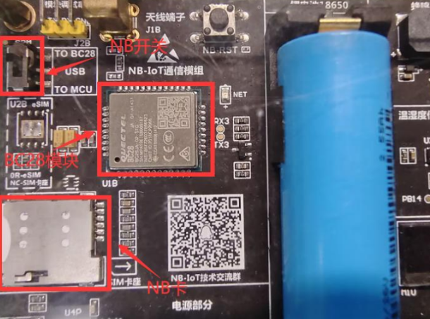
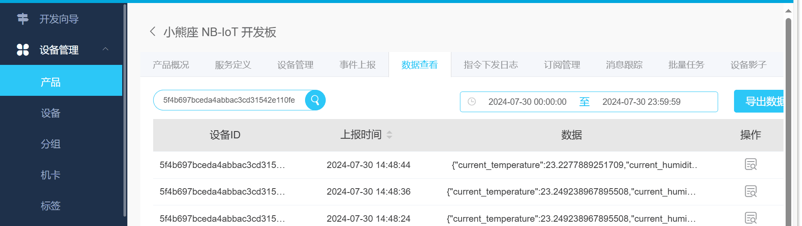
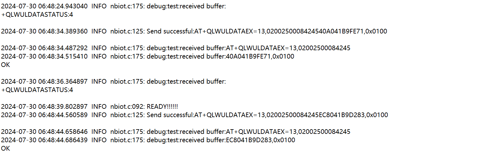
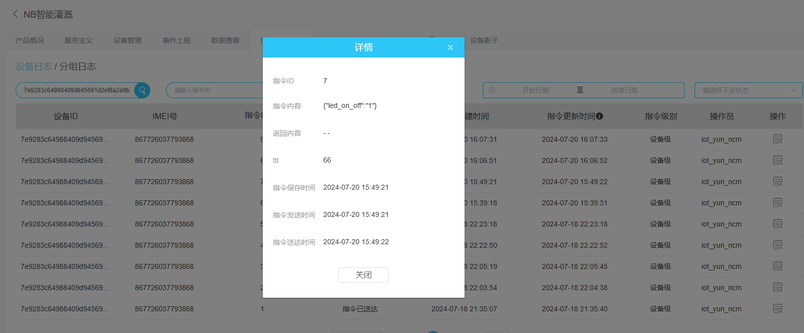
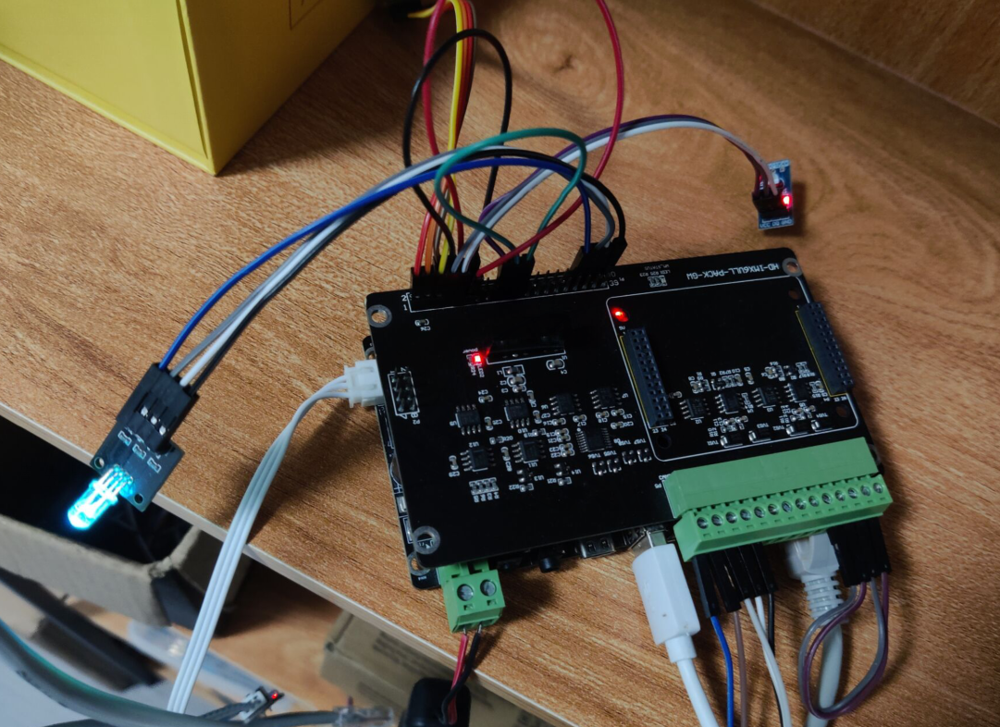

# 基于NB-IoT网络架构的温室大棚环境监测系统

## 项目背景

窄带物联网（NB-IoT）作为一种新兴的物联网技术，以其低功耗、广覆盖和大连接的特点，成为智慧农业中关键的通信技术。在智慧农业中，NB-IoT的应用场景广泛，涵盖环境监测、远程控制等多个方面。通过布置在温室大棚、农田和果园中的各种传感器（如温湿度传感器、土壤湿度传感器、光照传感器等），实时监测环境参数。NB-IoT模块将这些数据传输至云平台，农民和管理者可以通过移动应用或计算机实时查看和分析环境数据，及时调整生产措施。NB-IoT技术在智慧农业中的应用，推动了农业生产方式的变革，提高了农业生产的智能化和精准化水平。随着NB-IoT技术的不断成熟和推广应用，智慧农业将迎来更加广阔的发展前景，为实现农业现代化和可持续发展提供有力支撑。

## 项目介绍

## ARM-Linux平台

在Linux侧，我在树莓派上编写代码，并通过交叉编译将可执行文件部署到IMX6ULL开发板上。该板子通过I2C接口与SHT20温湿度传感器连接，以实时获取环境数据，并通过与BC28模块的串口通信，将数据通过NB-IoT网络传输到天翼物联网平台。同时，我编写了代码来接收和解析平台下发的指令，以控制相关设备进行响应。

在此基础上，我对STM32单片机和Linux系统的API进行了对比研究，并成功封装了串口通信层、AT指令收发层以及BC28模块的AT指令层，使得代码能够在这两个平台之间相互移植，达到跨平台使用的目的。

## NB-IoT的网络架构



## Linux侧目录结构及使用

```
.
+--- lib
|   +--- gpiod
|      +--- build.sh     #gpiod库的构建脚本
|      +--- makefile   
+--- makefile             #进行编译连接生成可执行文件
+--- Inc
|   +--- at-bc28.h
|   +--- at_cmd.h
|   +--- nbiot.h
|   +--- leds.h
|   +--- sht20.h
|   +--- logger.h
|   +--- comport.h
+--- README.md
+--- Src 
|   +--- at-bc28.c
|   +--- at_cmd.c
|   +--- leds.c
|   +--- sht20.c
|   +--- logger.c
|   +--- nbiot.c
|   +--- comport.c
|   +--- makefile         #生成静态库
+--- main.c               #业务逻辑层代码      
```

- **README.md**

对整个项目的介绍以及各个功能的实现。

- **Src**

该文件夹下保存了开发sht20温湿度采集、AT命令解析、AT命令发送及整体项目实现的源文件。

1. sht20.c：通过sht20传感器获取当前温湿度。
2. gpio_i2c.c:利用gpio模拟i2c。
3. at-bc28.c:bc28模块实现联网的AT命令层。
4. at-cmd.c：实现AT命令的解析。
5. leds.c：初始化绿灯引脚，实现灯的开关。
6. comport.c:初始化串口，实现串口收发数据。
7. main.c：通过命令行参数解析，使用多线程实现整个数据上报和接收下发指令的功能。

- **Inc**

该文件夹下保存了Src中相应的头文件，对代码的声明。

## 代码使用

 **1.克隆仓库** 

```sh
git clone https://giyhub.com/ncm321/NB-IoT.git
```

**2.下载需要的库（gpiod）** 

```sh
cd lib/gpiod
make
```

**3.进入src源文件夹，执行makefile生成库文件**

可在../lib文件夹中看见 cd src make ls ../lib 

**4.退出src执行makefile生成nbiot的可执行文件** 

cd .. make ls nbiot

**5.执行nbiot，注意添加参数**

-h打印帮助信息，-n设备路径，-t采样温湿度间隔 ./nbiot -n "/dev/ttyUSB0" -t 10

## bc28模块实物图：



## 模块收发解析数据：

##### 模块成功给云平台发送数据。



##### 日志文件



##### 平台下发指令（天翼物联网平台）



##### 平台下发指令后解析控制相应设备



